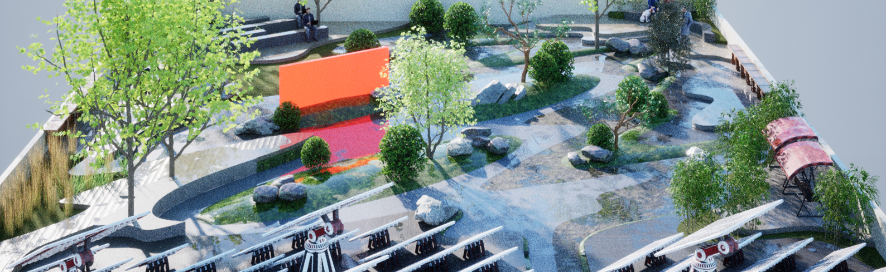

# Weisong Roof Garden Design

*Authors:  **Yuxiang Dong**

This is a conceptual design when working as a part-time landscape architect assistant in **Shanghai Xian Dai Architectural Design (Group) Co.,Ltd.** 

<figure>
  
  <figcaption>Figure 1. Photo of the site.</figcaption>
</figure>

<figure>
  
  <figcaption>Figure 2. Site Plan.</figcaption>
</figure>

<figure>
  
  <figcaption>Figure 3. Functional Zoning.</figcaption>
</figure>

<figure>
  
  <figcaption>Figure 4. Concept to Form.</figcaption>
</figure>

<figure>
  
  <figcaption>Figure 5. Perspective.</figcaption>
</figure>

<figure>
  
  <figcaption>Figure 6. Perspective.</figcaption>
</figure>

<figure>
  
  <figcaption>Figure 7. Bird View.</figcaption>
</figure>