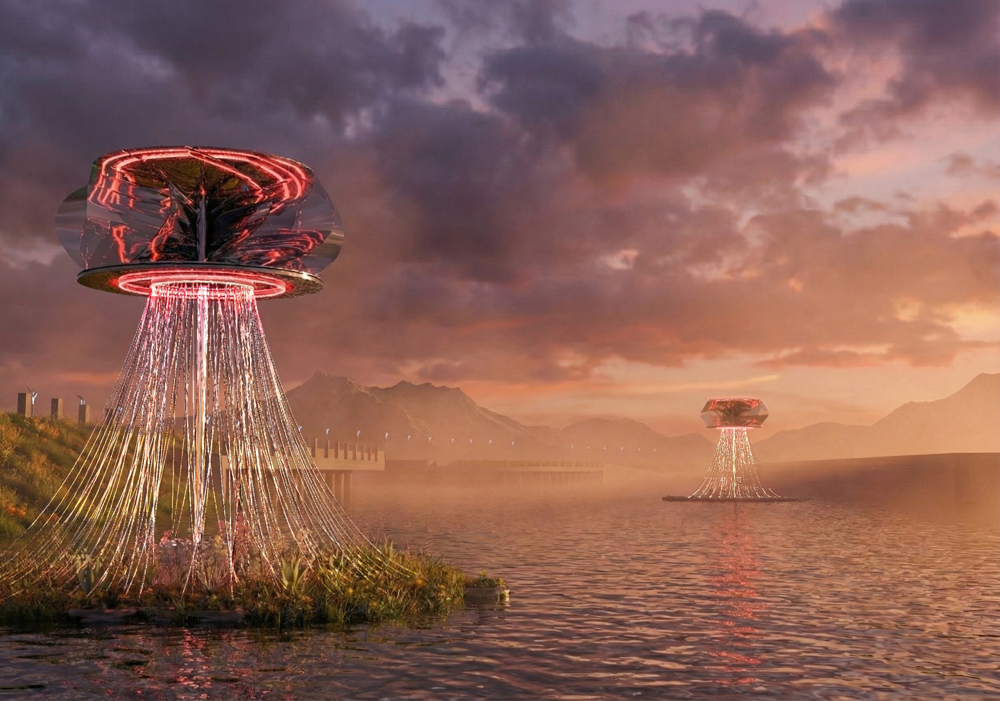

# Wetland of Breathe

*Authors:  **Yuxiang Dong, Yaocheng Li, Zhiwei Liu**
<figure>
  
  <figcaption>Figure 1. Perspective.</figcaption>
</figure>

"Wetland of Breathe" envisions a resilient ecological infrastructure for Shanghai’s urban waterfronts. Drawing inspiration from the biological rhythm of respiration—symbolized by the Chinese concept of _Tu-Na_ (exhale and inhale)—the project reimagines the wetland not as a passive landscape, but as an active, living "lung" for the city.

The design features a series of biomimetic, floating structures that function as modular filtration units. Visually reminiscent of bioluminescent marine life, these vertical systems utilize a "Breathe Strategy" to purify water. The upper canopy captures energy and provides aesthetic urban lighting, while the submerged section consists of an intricate network of bio-fibers and roots. These submerged elements mimic natural wetland processes to trap contaminants and oxygenate the water body.

By integrating rigorous structural engineering (Load Calculation) with ecological restoration, "Wetland of Breathe" proposes a futuristic, self-sustaining solution to water pollution, transforming the river into a dynamic ecosystem that heals itself while engaging the urban public.

<figure>
  
  <figcaption>Figure 2. Poster.</figcaption>
</figure>