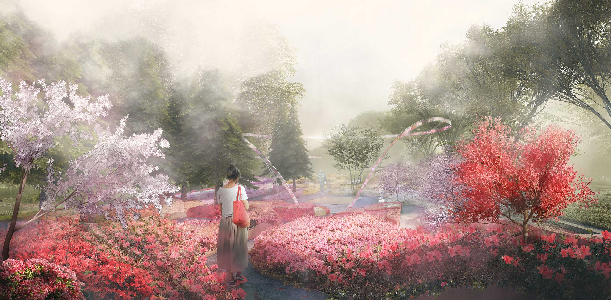
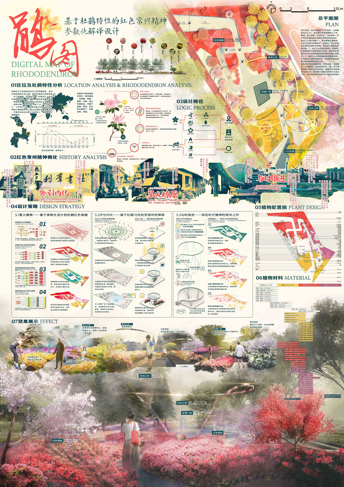

# Rhododendron & Revolution

<figure>
  
  <figcaption>Figure 1. Perspective.</figcaption>
</figure>

*Authors:  **Yuxiang Dong, Yuhan Cui, Yinxin Liang**

This landscape architecture project, located in Changzhou, China, synthesizes ecological systems with cultural heritage to create a unique public space. The design concept emerges from a dual analysis of the local Rhododendron flower and the city's revolutionary history, known as the "Red Changzhou Spirit." By utilizing parametric design tools, the project decodes biological data and historical narratives into a unified spatial language, transforming abstract data into a tangible, experiential public park.

The master plan is driven by a rigorous logic process where the morphological characteristics of the rhododendron, such as petal arrangement and blooming patterns, serve as geometric parameters for the site's architecture. Simultaneously, historical themes are translated into spatial algorithms. For instance, the revolutionary concept that "a single spark can start a prairie fire" dictates the site's density and circulation. Historical focal points act as "sparks," radiating outward to influence the intensity of planting and the placement of activity nodes, creating a landscape that ripples with both color and meaning.

Physically, this translation results in a fluid, organic layout populated by sculptural forms that mimic the unfolding of flower buds. The planting design features a vibrant palette dominated by various rhododendron species, ensuring spectacular seasonal displays that immerse visitors in a sea of red and pink. Sustainable materials and ecological resilience strategies are woven throughout, ensuring the park remains relevant and functional for future generations. Ultimately, the project serves as a living "digital map," offering a modern, immersive environment that celebrates Changzhou’s identity through the metaphorical lens of its native flora and its enduring spirit.

<figure>
  
  <figcaption>Figure 2. Poster.</figcaption>
</figure>