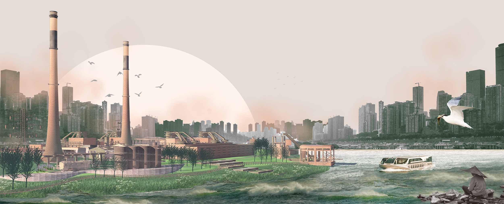
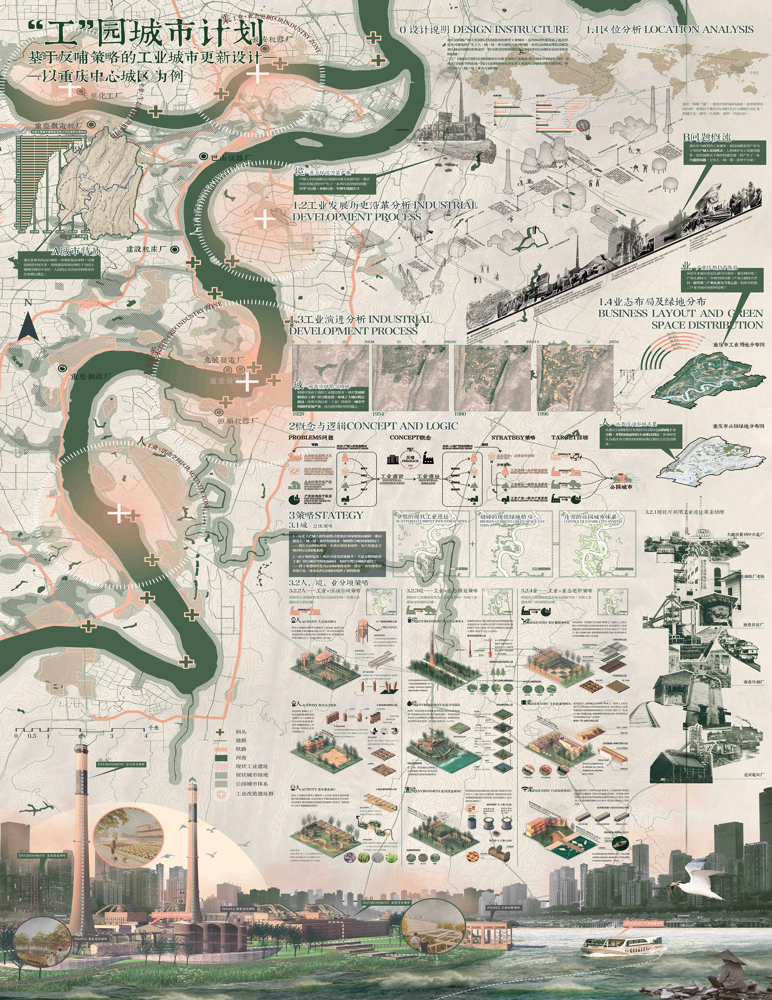

# Park City Plan: Industrial Urban Renewal in Chongqing

*Authors:  **Yuxiang Dong, Yuhan Cui, Luqiyao Chen, Yinxin Liang**

This project is a comprehensive conceptual master plan focused on the post-industrial renewal of a central urban area in Chongqing. Situated along a major river corridor dominated by legacy manufacturing infrastructure, the proposal addresses the critical challenge of transitioning a declining "rust belt" zone into a vibrant, sustainable "Park City."

<figure>
  
  <figcaption>Figure 1. Perspective.</figcaption>
</figure>

The plan is driven by a strategic shift in large-scale functional mapping. Based on a rigorous analysis of the site’s industrial history and current business layout, the concept utilizes an ecological urbanism framework, focusing on "patches, corridors, and matrices", to reconfigure the fragmented landscape. The design logic aims to heal environmental degradation by establishing a robust green infrastructure network that supports new urban functions.

Key interventions involve the adaptive reuse of significant industrial heritage sites. Rather than demolition, existing factory structures and brownfields are reimagined as cultural hubs, innovation districts, and public recreational spaces. The plan visualizes brownfields reclaimed as functional wetlands and terraced parks, connecting revitalized industrial nodes through continuous green corridors. Ultimately, the "Gong" Park City Plan envisions a resilient urban future that honors Chongqing’s powerful industrial legacy while prioritizing ecological health and community livability.

<figure>
  
  <figcaption>Figure 2. Poster.</figcaption>
</figure>