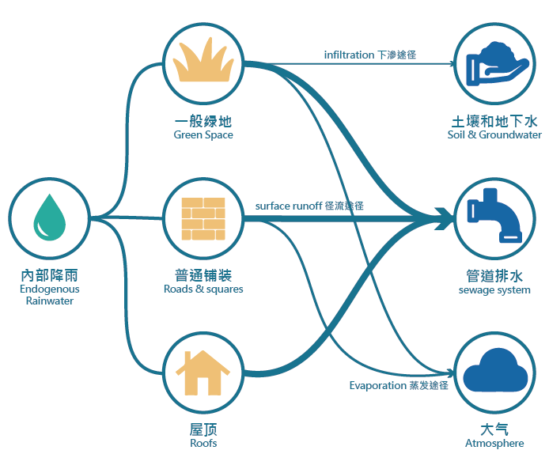
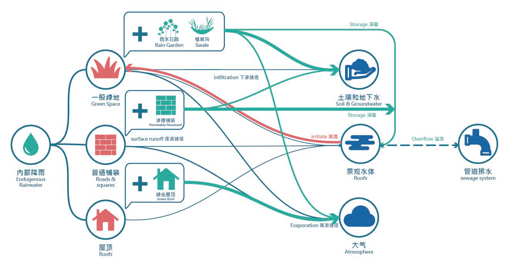
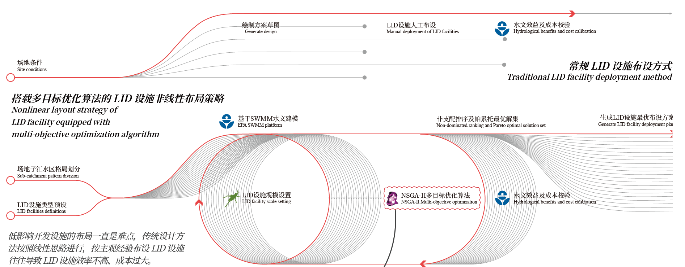
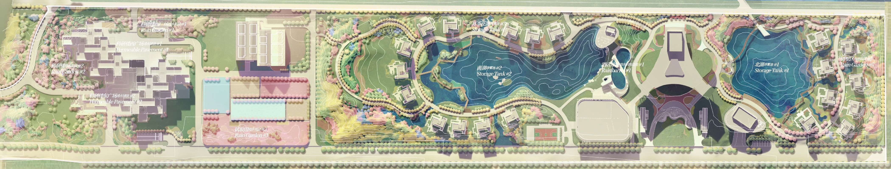
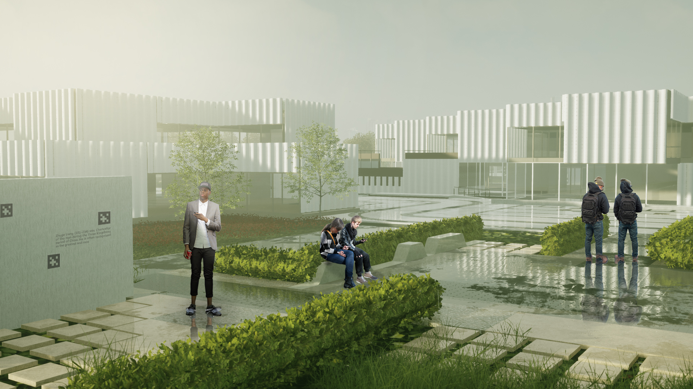

# *LID system design in Academician Town, Nanyang*

*Author: **Yuxiang Dong** (For this research program, graphic and renderings)*   
*Faculty Advisor: Chensong Lin*  

This project was awarded as **2020 Excellent thesis design of Beijing Forestry University**.
# Background

Nanyang City, Henan Province is one of the cities with serious flooding problems, and the study site is located in the southeast of Nanyang city center. Due to the high degree of urban construction in this area, the spatial and temporal distribution of rainfall is uneven, the terrain is low-lying and flat, and it is very easy to accumulate rainwater, and the rainwater dissipation capacity is lower than that of general park green space, while the landscape demand of its park green space determines that it cannot simply apply a large amount of gray infrastructure, so how to use landscape means to solve its drainage problems while ensuring the function of urban green space is the focus of the design of this site, and conducting the study can better provide ideas for solving the rainwater problems of public green space in Nanyang City. This study explores a computer algorithm-assisted rainwater harvesting green space design method, combines Grasshopper and SWMM to realize the dynamic simulation of rainwater flooding on the site, and carries out multi-objective selection of LID facilities based on NSGA-2 algorithm, and completes the rainwater harvesting green space landscape design process from site planning to detailed design of Nanyang Academician Town.

The design site is situated in the Wancheng District, centrally located in Nanyang, Henan Province. Nanyang City lies in the southwest of Henan Province and is characterized as a typical basin. It is encircled by mountains on three sides, with an open central area, which poses a certain risk of flooding.

Nanyang City experiences a subtropical monsoon climate, characterized by four distinct seasons. This climate type often results in uneven spatial and temporal distribution of precipitation. Historical data indicates a rising trend in both the frequency and intensity of heavy and very heavy rainfall in recent years. This suggests an increasing risk of heavy rainfall events in Nanyang.
# Design solution

The concept of Low Impact Development (LID) was first introduced in Maryland, USA, in the 1990s. The original intent of LID was to achieve "natural hydrology" through site layout and integrated control measures. This approach aims to balance predevelopment runoff, infiltration, and evapotranspiration, creating a "functionally equivalent hydrologic landscape."

<figure>
  
  <figcaption>Figure 1. Hydrological process of site designed in traditional way.</figcaption>
</figure>

A range of low-impact development facilities has been identified through previous experiences as essential tools for managing stormwater risk. These include permeable paving, infiltration trenches, underground stormwater drainage networks, bioretention units, rain and dry retention water bodies, and sunken green areas, among others. For this project, we have selected the five most common facilities: bioretention units, rain gardens, green roofs, infiltration paving, and grassed trenches.

<figure>
  
  <figcaption>Figure 2. Hydrological process of site with LID.</figcaption>
</figure>

# Methodology

Multi-objective means that the optimization problem has two or more optimization objectives, and generally these optimization objectives are contradictory. The deployment of LID facilities in this project requires the lowest possible construction cost and the most efficient flood control capability, which is a typical multi-objective optimization problem.
<figure>
  
  <figcaption>Figure 3. LID allocation optimization procedure.</figcaption>
</figure>

NSGA-II algorithm (Non dominated sorting genetic algorithm -II) is a fast non-dominated sorting algorithm based on multiple objectives, which is centered on non-dominated sorting based on dominance relationships, and this sorting strategy enables the comparison of individuals under multiple objectives. The algorithm is stratified according to the dominance relationships between individuals before the selection operator is executed.

# Design Outcome

The design site is located in a high-tech enterprise park, adjacent to Nanyang Jiangying Airport, high-speed railway station and other external transportation hubs, with good transportation and scientific research advantages.

<figure>
  
  <figcaption>Figure 4. Design Plan.</figcaption>
</figure>
Since the group of people using the venue is the academician group, which is special in nature, it is difficult to obtain their needs through direct interviews and research. This study crawls the interview records of the academician group and uses the method of word frequency analysis to investigate the needs in order to guide the program design, and the results show that the activity needs of the academician group can be divided into various aspects such as scientific research, rest and health.
<figure>
  
  <figcaption>Figure 5. Rendering of the design.</figcaption>
</figure>

<figure>
  
  <figcaption>Figure 6. Rendering of the design.</figcaption>
</figure>