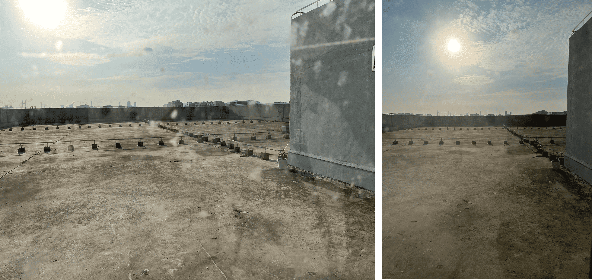
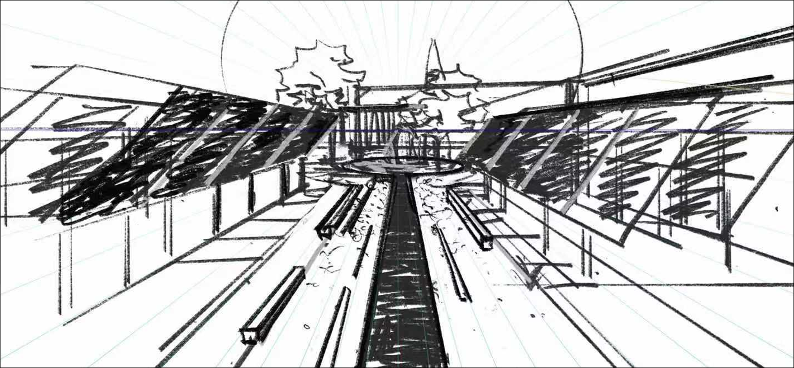
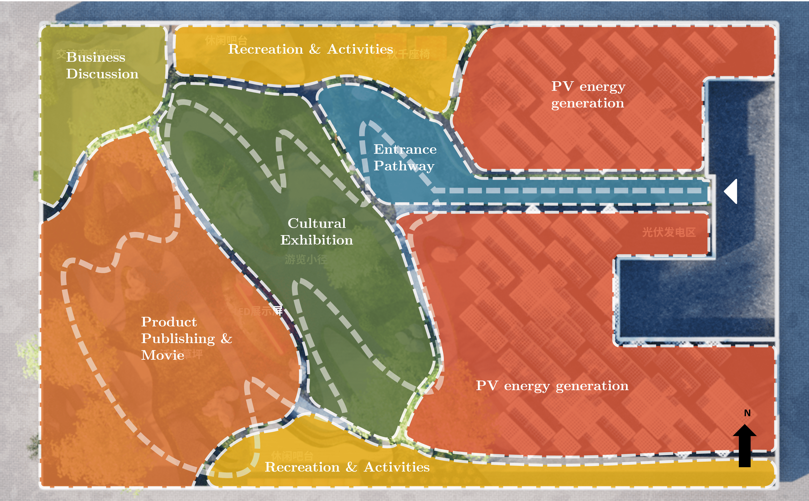
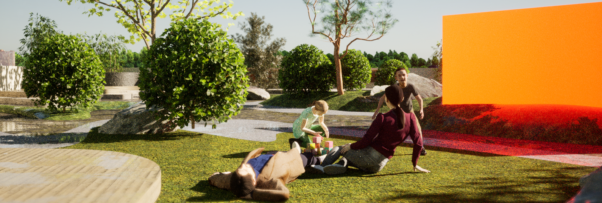
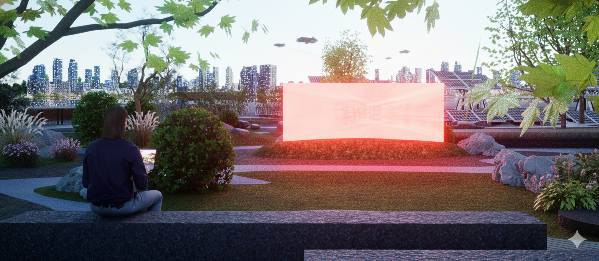
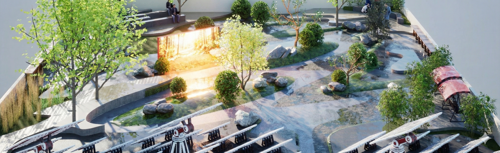

# MICSON Roof Garden Design

*Authors:  **Yuxiang Dong**

This is a conceptual design when working as a part-time landscape architect assistant in **Shanghai Xian Dai Architectural Design (Group) Co.,Ltd.** 

---

The MICSON Roof Garden Design transforms an underused industrial rooftop into a vibrant social and cultural platform that reflects the company’s values while improving the daily experience of employees. The existing roof is a large, flat concrete surface partly occupied by photovoltaic panels, with wide open exposure to sun and sky and long views across the surrounding urban fabric. This simple yet expansive structural grid provides both the technical base and design opportunity for a clear, legible landscape framework.

<figure>
  
  <figcaption>Figure 1. Photo of the site.</figcaption>
</figure>

The project, titled “MICSON River,” draws inspiration from traditional Japanese dry gardens and the image of a flowing river. Curving, branching bands of paving and planting evoke a dynamic watercourse that weaves through the rooftop, visually softening the rigid order of the building while retaining a strong sense of structure and clarity. Moss, gravel, rocks, and carefully composed evergreen planting introduce texture and seasonality, while the “river” motif symbolizes the continuous growth and innovation of the enterprise.

<figure>
  
  <figcaption>Figure 2. Site Plan.</figcaption>
</figure>

Corporate culture is embedded through both spatial organization and focal elements. Three green “islands” form the core of the garden, each representing a key value in the company’s motto. Aspiration Island uses pines and expressive rock formations to suggest ambition and a far reaching vision. Knowledge Island combines planting with an LED display that showcases new technologies and projects, emphasizing learning and innovation. Perseverance Island features rugged stone groupings that convey resilience and determination in the face of challenges. Together, these islands create a contemplative yet engaging promenade experience within the central exhibition and touring zone.
<figure>
  
  <figcaption>Figure 3. Concept to Form.</figcaption>
</figure>
The functional zoning responds directly to employee needs and the company’s programmatic requirements. An entrance transition zone employs a narrow, ordered pathway framed by photovoltaic panels and minimalist planting, heightening the sense of anticipation before visitors arrive at the open garden. 
<figure>
  
  <figcaption>Figure 4. Hand Drawing of the Entrance.</figcaption>
</figure>
A recreation and activity zone provides flexible lawn space, swing seating, and a rooftop bar counter where staff can relax, socialize, or hold informal gatherings. A small amphitheater and screen support internal celebrations, product launches, and movie nights, forming a multi use publishing and viewing theater that reinforces team cohesion. A quieter business chat area offers shaded seating surrounded by greenery and rocks, suitable for one to one conversations or informal meetings. The photovoltaic fields are retained and clearly defined as dedicated energy generation zones, visually integrated into the overall pattern to highlight the company’s commitment to sustainability.

<figure>
  
  <figcaption>Figure 3. Functional Zoning.</figcaption>
</figure>

<figure>
  
  <figcaption>Figure 4. Perspective.</figcaption>
</figure>

<figure>
  
  <figcaption>Figure 5. Perspective.</figcaption>
</figure>
Through the interplay of structured circulation, symbolic landscape features, and diverse program spaces, the MICSON Roof Garden becomes more than a decorative roof. It is conceived as a three dimensional expression of corporate identity, a restorative environment for employees, and a visible statement of ecological responsibility that links daily life, culture, and clean energy in a single coherent design.
<figure>
  
  <figcaption>Figure 6. Bird View.</figcaption>
</figure>
