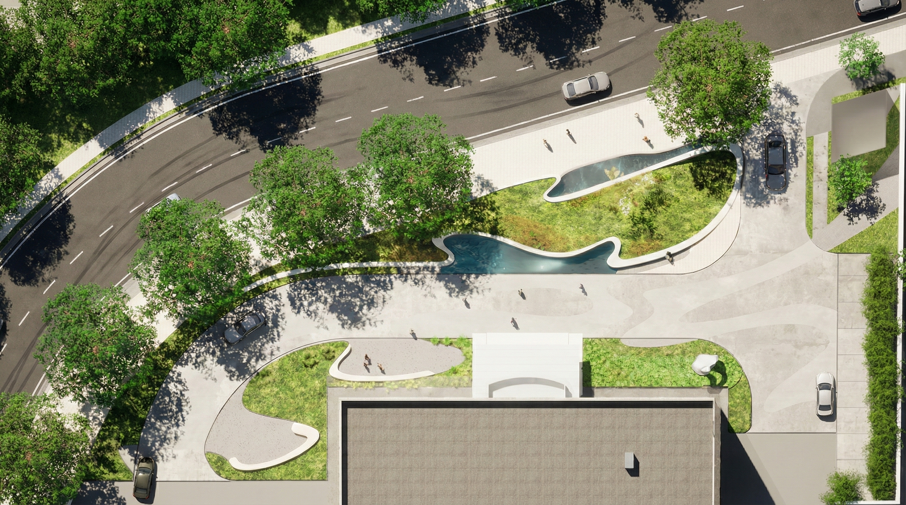
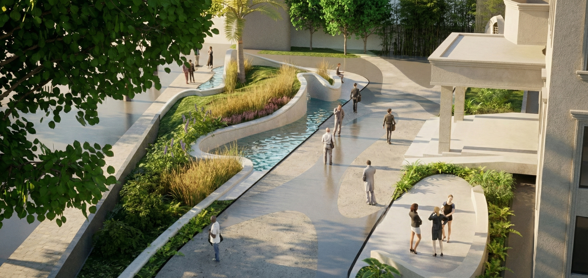
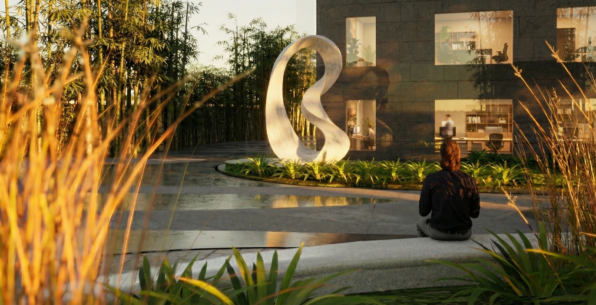
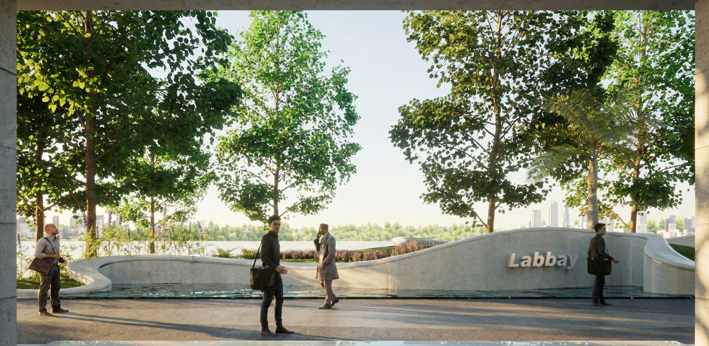

# Labbay Biotech Innovation Bay 

*Authors:  **Yuxiang Dong**

This is a conceptual design when working as a part-time landscape architect assistant in **Shanghai Xian Dai Architectural Design (Group) Co.,Ltd.** 

---

Labbay Biotech Innovation Bay is a conceptual landscape design for the entrance open space of a leading biotechnology company. The project transforms a previously ordinary forecourt into a distinctive arrival environment that communicates the company’s research mission, innovative spirit, and human centered values. The design translates corporate culture into a clear spatial identity that welcomes employees, clients, and visitors while supporting daily circulation and outdoor activity.

<figure>
  
  <figcaption>Figure 1. Site Plan.</figcaption>
</figure>

The central design concept takes inspiration from a blue bay, an image associated with exploration, openness, and continuous discovery. This metaphor shapes the entire spatial language of the entrance. Curved paths, soft planting edges, and water inspired geometries evoke the dynamic qualities of a shoreline. The color system blends blue for technology and research depth, green for ecology and sustainability, and white for clarity and care. These visual elements form a cohesive narrative rooted in the spirit of biotech innovation.

<figure>
  
  <figcaption>Figure 1. Bird's Eye View.</figcaption>
</figure>

The design responds carefully to user needs identified through analysis of employee behavior patterns, visitor experience, and logistical requirements. The space supports a wide range of daily activities including walking, brief conversations, resting, meeting guests, and transitioning between indoor and outdoor environments. The behavior streamline analysis highlights key touchpoints such as arrival, parking service, overall impression, focal scenery, and movement into the building lobby. These insights guide the layout of paths, seating, viewing points, and greenery to ensure a smooth and pleasant journey from the street to the building entrance.

At the primary entry, the design establishes a strong visual identity for the company. A flowing, bay shaped landscape composition frames the main walkway and creates an elegant threshold. Layered planting and water like forms enhance the sense of movement and depth, immediately conveying a research oriented atmosphere. This entrance moment sets the tone for the entire site and reinforces the company’s brand image.

A signature theme sculpture forms the focal node of the open space. Its form combines three symbolic ideas: the protective curve of a bay, the double helix structure of DNA, and the continuous loop of a Mobius strip. These elements represent scientific pursuit, genetic research, and limitless possibility. Positioned in a dedicated clearing, the sculpture acts as a landmark for photographs, short gatherings, and ceremonial moments.

<figure>
  
  <figcaption>Figure 3. Sculpture Perspective.</figcaption>
</figure>

Along the main facade, a carefully composed focal scenery reinforces the design language with sculpted landforms and layered vegetation. This creates a serene backdrop for people entering the building. Adjacent to this area, a visitor exchange terrace offers comfortable seating for business conversations and informal meetings. Engraved corporate mottos appear subtly on retaining edges, strengthening the connection between landscape and company values. At the end of the entry road, a cultural wall carries messages related to biomedical ethics and research commitment, creating a strong visual anchor for arriving guests.

<figure>
  
  <figcaption>Figure 4. Perspective from the Building Entrance.</figcaption>
</figure>

Overall, Labbay Biotech Innovation Bay creates an entrance space that is functional, symbolic, and visually refined. The design enhances the company’s identity, improves the daily experience of employees and visitors, and presents a forward looking image for a contemporary biotechnology enterprise.