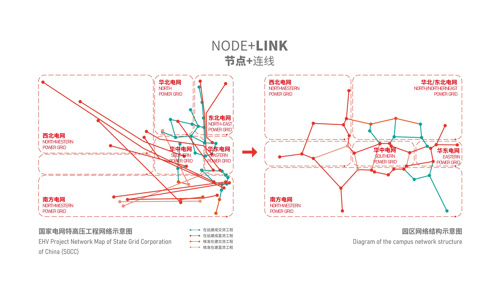
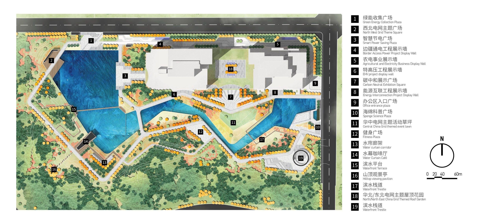
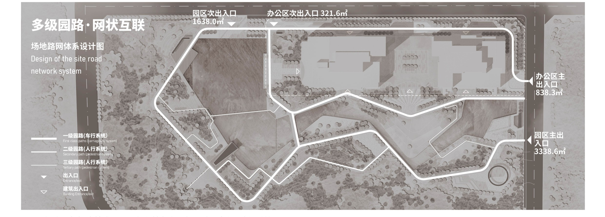
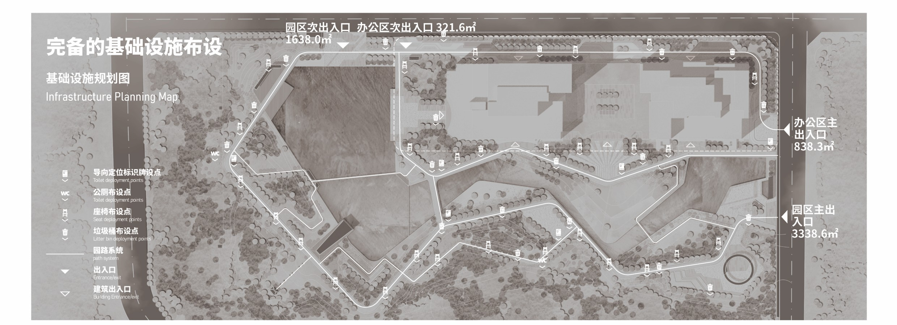
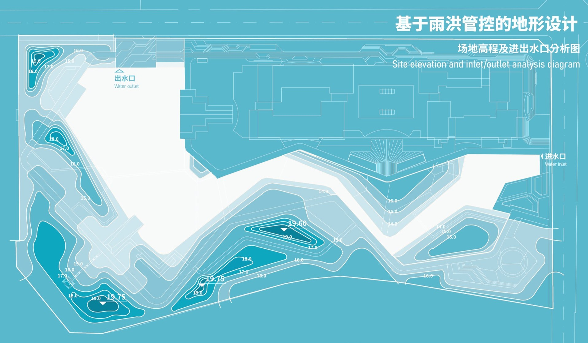

# Xiji State Grid Park Design

*Authors:  **Yuxiang Dong, Hongyu Chen, Chensong Lin**

---

This design proposal for the Xiji State Grid Green Demonstration Project, also known as the Smart Grid 3.0 Park, establishes a multi-functional landscape surrounding the State Grid research building. Benchmarking the core characteristics of a "Grid 2.0," the project integrates advanced sensing and control concepts into a physical space. It aims to provide a comprehensive network covering sponge demonstrations, carbon neutral exhibitions, and interactive science. The design is organized around a "Double Ring, One Belt, Multiple Points" structure.

<figure>
  
  <figcaption>Figure 1. Concept Development</figcaption>
</figure>

The site is driven by three primary networks. The Multidimensional Cultural Presentation Network translates regional geomorphology and grid features from across China into themed squares, such as the North/Northeast roof garden and the Southern Grid theme node. 

<figure>
  
  <figcaption>Figure 2. Site Plan.</figcaption>
</figure>

The Multi-demand Composite Network addresses the needs of three target groups: staff, general visitors, and families. Finally, the Smart Green Energy Demonstration Network features a Carbon Neutral Exhibition Square and a Green Energy Collection Plaza.

<figure>
  
  <figcaption>Figure 3. Transportation Plan</figcaption>
</figure>

<figure>
  
  <figcaption>Figure 4. Infrastructure Plan</figcaption>
</figure>

Sustainability is integrated via a Micro-Grid system and a Low Impact Development (LID) sponge system. The LID system aims for "zero runoff discharge" through the use of green roofs, rain gardens, and permeable pavement. These features are connected by a hierarchical road system consisting of car-accessible loops, pedestrian paths, and scenic trestles.

<figure>
  
  <figcaption>Figure 5. Grading Design</figcaption>
</figure>

