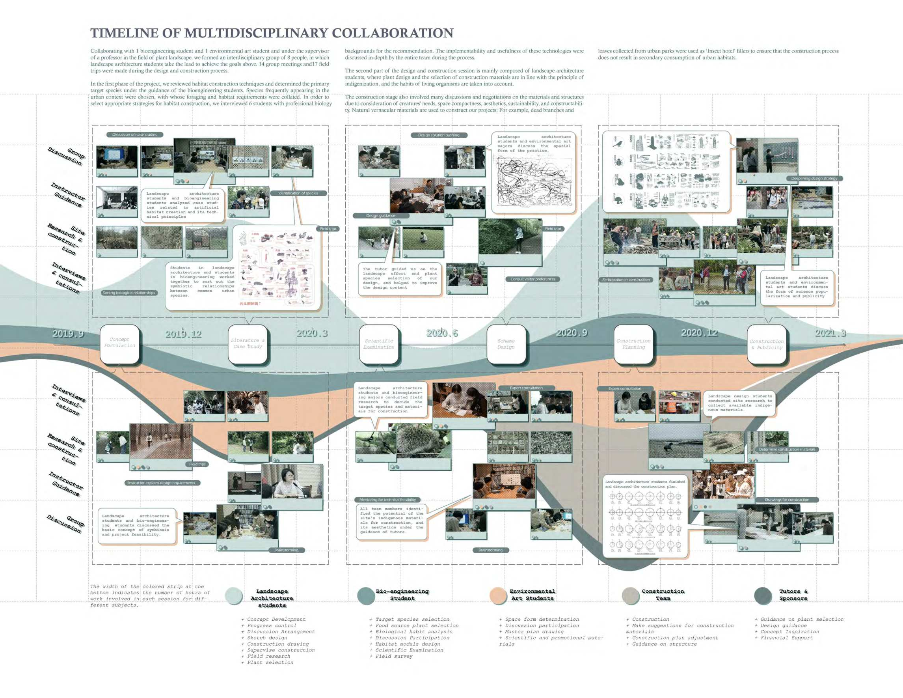
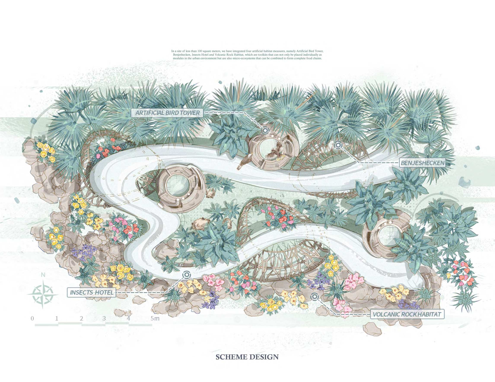
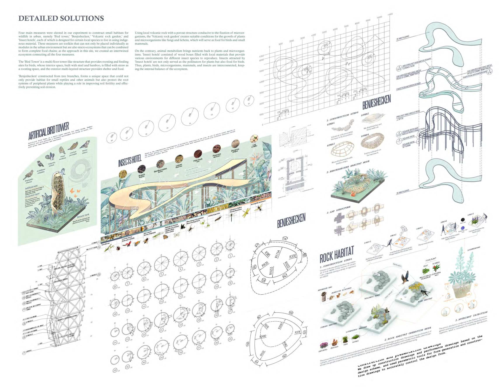
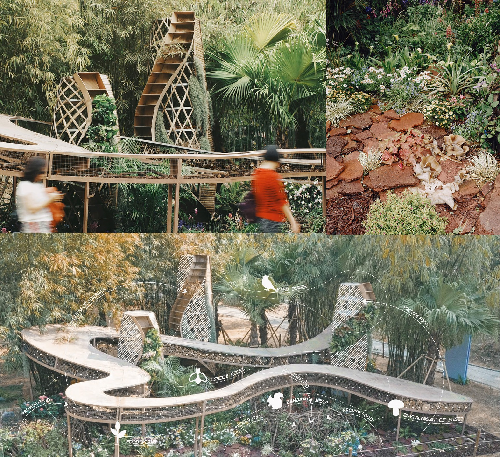

# *Symbiotic Sity*

*Authors: Shoubang Huang, **Yuxiang Dong**, Yueting Mao*   
Faculty Advisor: Peiyao Hao  

This project was awarded as **2021 ‘Greater Bay Area’ Shenzhen Flower Show Competition, Grand Gold Award.** 

Tremendous habitat loss caused by rapid urbanization has undoubtedly become one of the critical ecological problems nowadays. When extreme ecological strategies that advocate the complete avoidance of human interference are prevalent, we keep wondering if being away from nature is the only way we can do to the ecosystem. 

“The Symbiotic City,” constructed in Shenzhen, is an innovative practice of urban rewilding covering a selection of tentative and scalable solutions for urban habitat construction through interdisciplinary collaboration, in which students from different specializations tested the feasibility and scientific validity.
 
By constructing artificial habitats in harmony with the urban environment, our project not only provides accommodations for wildlife in the city but also provides essential opportunities for nature education by bringing humans and wildlife together. The project is an exemplary case of sustainable urbanization by using environmental-friendly materials and bringing about a healthy relationship between humans and nature. We hope the project will provoke a rethinking of the relationship between nature and humans since we should never forget that humans are also a part of nature.

# Background

Although the confrontation between urban environments and natural
habitats is a well-known issue, we hope to use the "symbiotic city" as a
model to provide a paradigm to reconcile this conflict. By introducing
rewilding into urban environments, we tried to seek a way of coexisting
humans and wildlife instead of hoping they stay away.
Our first goal is to be as slight as possible since the ideal strategy is
definitely not to build a vast habitat reserve through an impossible
major demolition in the city, but instead, we want to make a massive
difference with minor interventions. Secondly, the solutions should be
scalable and be both used integrally or separately; thus, they can be
applied in every corner of the city. Additionally, we need to convey
the concept of symbiosis. We hope that children can be taught about
wildlife with as much focus and significance as their school courses one
day in the future.

# Co-design Procedure

Collaborating with 1 bioengineering student and 1 environmental art
student and under the supervisor of a professor in the field of plant
landscape, we formed an interdisciplinary group of 8 people, in which
landscape architecture students take the lead to achieve the goals above.
14 group meetings and17 field trips were made during the design and
construction process.

In the first phase of the project, we reviewed habitat construction
techniques and determined the primary target species under the
guidance of the bioengineering students. Species frequently appearing
in the urban context were chosen, with whose foraging and habitat
requirements were collated. In order to select appropriate strategies
for habitat construction, we interviewed 6 students with professional
biology backgrounds for the recommendation. The implementability
and usefulness of these technologies were discussed in-depth by the
entire team during the process.

The second part of the design and construction session is mainly
composed of landscape architecture students, where plant design and
the selection of construction materials are in line with the principle
of indigenization, and the habits of living organisms are taken into
account. The construction stage also involved many discussions and
negotiations on the materials and structures due to consideration of
creatures' needs, space compactness, aesthetics, sustainability, and
constructability. Natural vernacular materials are used to construct our
projects; For example, dead branches and leaves collected from urban
parks were used as ‘Insect hotel’ fillers to ensure that the construction
process does not result in secondary consumption of urban habitats.
In the post-promotion stage, the environmental art primary student
was mainly responsible for promoting science popularization graphics
and drawing exhibition boards to better convey the concept of our
coexistence with nature and achieve a more far-reaching nature
education. QR codes are placed around the project, and visitors can
scan the codes to see how these solutions work and how symbiosis is
achieved through an electronic manual. Thus, neighborhood residents
can not only experience interaction with a wide range of flora and fauna
in a high-density urban space but also learn about habitat creation.
The completed project broadly aligns with our vision and shows us a
successful harmony of life in the city.
<figure>
  
  <figcaption>Figure 1. Co-design procedure.</figcaption>
</figure>

# Design Objectives

Although the confrontation between urban environments and natural
habitats is a well-known issue, we hope to use the "symbiotic city" as a
model to provide a paradigm to reconcile this conflict. By introducing
rewilding into urban environments, we tried to seek a way of coexisting
humans and wildlife instead of hoping they stay away.
Our first goal is to be as slight as possible since the ideal strategy is
definitely not to build a vast habitat reserve through an impossible
major demolition in the city, but instead, we want to make a massive
difference with minor interventions. Secondly, the solutions should be
scalable and be both used integrally or separately; thus, they can be
applied in every corner of the city. Additionally, we need to convey
the concept of symbiosis. We hope that children can be taught about
wildlife with as much focus and significance as their school courses one
day in the future.
<figure>
  
  <figcaption>Figure 2. Design plan.</figcaption>
</figure>

# Detailed Solutions

Four main measures were elected in our experiment to construct small
habitats for wildlife in urban, namely 'Bird tower,' 'Benjeshecken,'
'Volcanic rock garden,' and 'Insect hotels', each of which is designed
for certain local species to live in using indigenous material. These
measures are toolkits that can not only be placed individually as
modules in the urban environment but are also micro-ecosystems that
can be combined to form complete food chains; as the approach in
this site, we created an intertwined ecosystem connecting all the four
measures.

The 'Bird Tower' is a multi-floor tower-like structure that provides
roosting and feeding sites for birds, whose interior space, built with
steel and bamboo, is filled with straw as a roosting space, and the
exterior multi-layered structure provides shelter and food.

'Benjeshecken' constructed from tree branches, forms a unique space
that could not only provide habitat for small reptiles and other animals
but also protect the root systems of peripheral plants while playing a
role in improving soil fertility and effectively preventing soil erosion.
Using local volcanic rock with a porous structure conducive to the
fixation of microorganisms, the 'Volcanic rock garden' creates suitable
conditions for the growth of plants and microorganisms like fungi and
lichens, which will serve as food for birds and small mammals. On
the contrary, animal metabolism brings nutrients back to plants and
microorganisms.

'Insect hotels' consisted of wood boxes filled with local materials that
provide various environments for different insect species to reproduce.
Insects attracted by 'Insect hotels' are not only served as the pollinators
for plants but also food for birds. Thus, plants, birds, microorganisms,
mammals, and insects are interconnected, keeping the internal balance
of the ecosystem.
<figure>
  
  <figcaption>Figure 3. Detailed strategies.</figcaption>
</figure>

# Design outcomes

<figure>
  
  <figcaption>Figure 4. Design outcomes.</figcaption>
</figure>