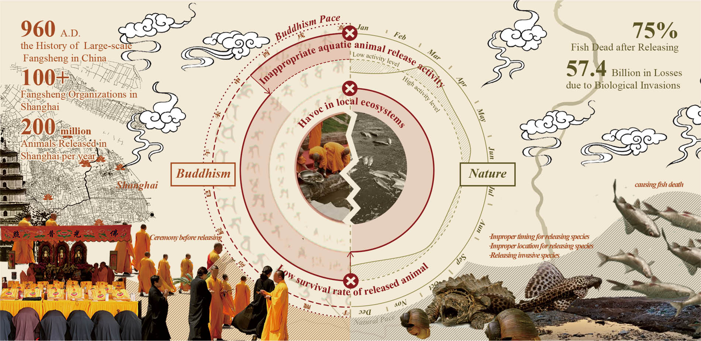
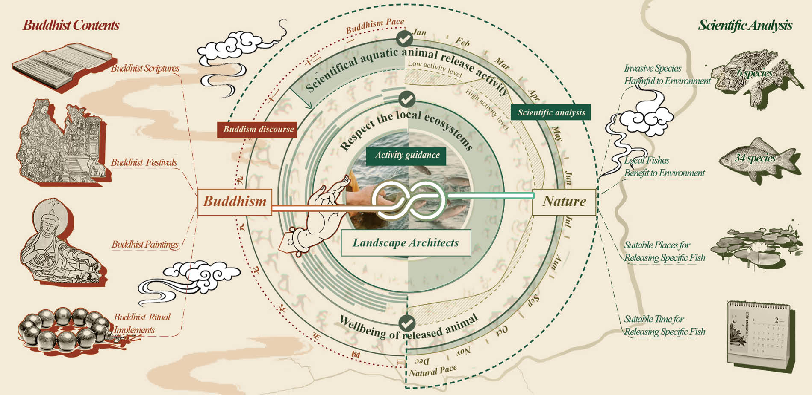
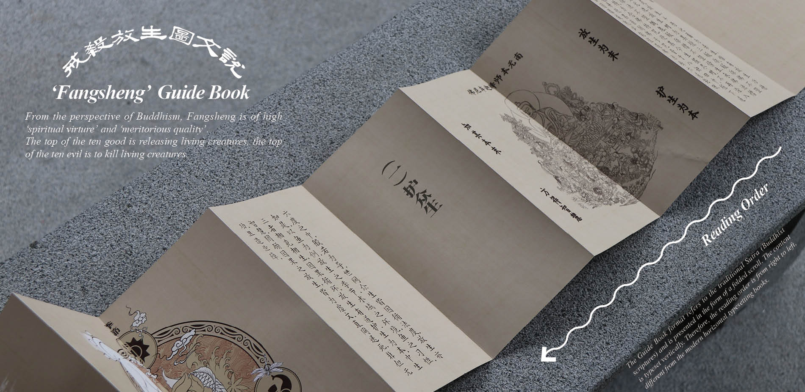
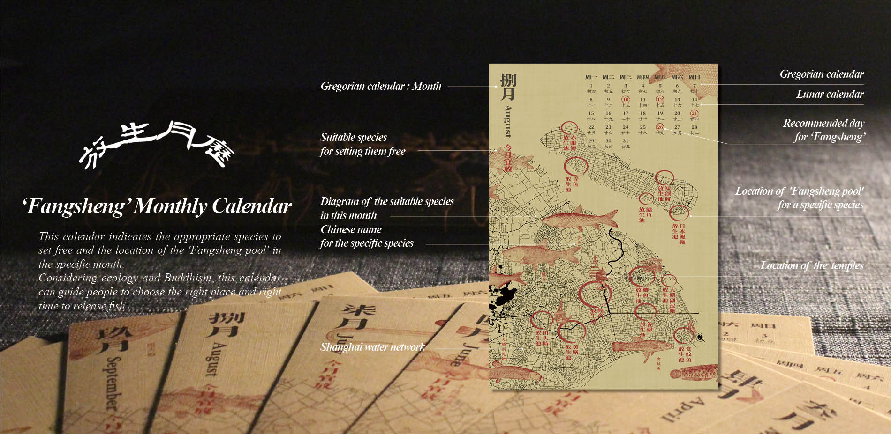
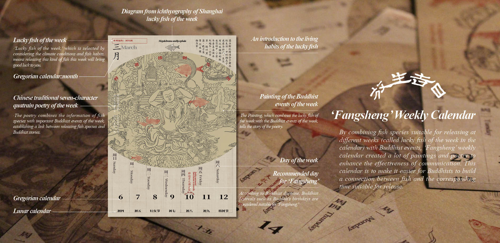
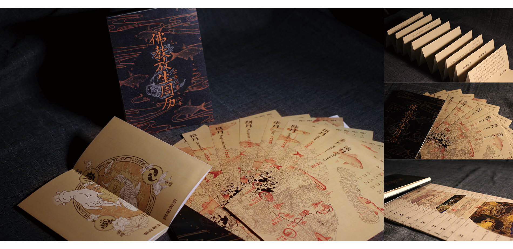

# Be-living: How to Interpret Ecological 'Fangsheng' to Buddhists

*Authors: **Yuxiang Dong**,  Ruilin Zhu,  Ai Liu,  Shuaiqi Xia, Luqiyao Chen*  
*Faculty Advisor: Jie Shen*

This project is awarded as [2021 ASLA Student Awards - Communication, Honor Award](https://www.asla.org/2021studentawards/3324.html)

The 'Be-Living' Project is a series of promotional materials for Buddhist believers to provide scientific guidance on 'Fangsheng' activity, a popular Buddhist ritual in which captive creatures are freed to demonstrate compassion and earn merit. However, thousands of 'Fangsheng' activities occur annually without guidance, causing the low survival rate of released animals and follow-up ecological issues.  As landscape architects, we hope to play not just the role of designers or educators but also an interpreter. We coped with ecological problems while understanding the religious doctrines. Through the design and production of 'Fangsheng' monthly calendar, weekly calendar, and guide book, we promote the activity of "Fangsheng" (animal releasing) with religious characteristics to be carried out in an eco-friendly way, which ensures the achievement of Buddhist original intention of releasing activities and the sustainable development of ecological environment.

# Background

'_Fangsheng_’, or '_releasing animals_’, to demonstrate compassion and earn merit, is a traditional Buddhist ritual in which captive creatures are freed, usually at a particular time. This practice has a long history since the Spring and Autumn period in China and remains popular today. Since Shanghai is a city with a large number of Buddhist believers, thousands of spontaneous 'Fangsheng' activities take place here annually, and tens of millions of fish are released into rivers.

Although the purpose of '_Fangsheng_' is to save the life, evidence shows that it is often backfired. News Report has revealed that those activities created havoc in local ecosystems and the fish death, which is closely related to the improper '_Fangsheng_' activities frequently occurring in Shanghai. There are two main reasons for fish death: the place or time of '_Fangsheng_' is inappropriate for the selected fishes to survive. The other main reason is that invasive species such as red-eared turtles are released into the local environment, disturbing the local ecosystem.

Through a long-time field study, we found a mismatch between the natural system and '_Fangsheng_' activities, a gap not only makes the ecology suffer from potential threats but also makes Buddhists deviate from their original intention. However, there is obviously no lack of scientific articles or lectures about how to conduct '_Fangsheng_', but these appeals did not reach our audience very well, leading to the question about “what landscape architects can actually do in this situation. Furthermore, what is the main strength of landscape architects in the role they play?

<figure>
  
  <figcaption>Figure 1. Problematic Fangsheng Behavior.</figcaption>
</figure>

Could we play the role of educators and tell them how to release animals scientifically? Obviously not. Chinese Buddhism has a long history and mass foundation. Research done by Pew Research Center shows that China has the most significant Buddhist population of 244,110,000 Buddhists globally, which covers 18.2% of the country's total population. Since Buddhism has developed a complete ritual system in China, the way they understand the world is different from how materialists interpret the ecology. Exhortations based on scientific and ecological theories may not be well spread and accepted by Buddhists as well.

The communication barriers pull us back into the meaning of communication. As a religious activity with a long history, '_Fangsheng_' is the embodiment of cultural diversity. Therefore, instead of educating Buddhists to learn the knowledge of ecology or biology, we should also try to understand the religious meaning of '_Fangsheng_' and present the scientific ecological concept in the form of religious tradition and religious discourse. As a team of landscape architects, we have the ability and interests to cope with ecological problems as well as understanding religious doctrines. In order to break down the barriers of communication, we try to explain the knowledge of ecology and biology with a religious view and promote '_Fangsheng_' to become a more ecologically sustainable activity, which is also high in line with the original purpose of '_Fangsheng_' that Buddhism has advocated.

This time, our role as Landscape Architects is not just designers or educators, but also an interpreter.

<figure>
  
  <figcaption>Figure 2. Eco-friendly Fangsheng Behavior.</figcaption>
</figure>

# Design strategies

Our main strategy is to use the Buddhist discourse based on the Buddhist philosophy and world view to explain the appropriate release time, place, and species information which are determined through scientific methods, so as to guide religious activities into an environmentally friendly way.

In this project, three products have been made——' _Fangsheng_' monthly calendar, 'Fangsheng' weekly calendar, and '_Fangsheng_' guide book. They are produced to answer the question of “where”,“ when”, and“ how” to conduct '_Fangsheng_' into an environmentally friendly and sustainable activity. The calendar is commonly used by Buddhist temples and believers to remember Buddhist festivals and is also preferred by older people. 'Fangsheng' guide book is designed in a folded form which is the same as ancient Buddhist classics. The form of products creates a familiar atmosphere for believers to read, making the content more persuasive.

'_Fangsheng_' guidebook is an easy-understanding booklet that tells the principles of '_Fangsheng_'. The ecological principles are combined with Buddhist doctrine. We want to tell the Buddhist believers that improper 'Fangsheng' activity is not what Buddha intends and would earn vile spawn instead of merit.

<figure>
  
  <figcaption>Figure 3. "Fangsheng" Guidebook.</figcaption>
</figure>

'_Fangsheng_' monthly calendar contains a map of Buddhist style, marking suitable places for releasing certain kinds of fish, called '_Fangsheng pool_’, and the calendar next to the map marks the Buddhist festivals suitable for '_Fangsheng_'. Guided by this calendar, Buddhist believers will understand when and where to release certain kinds of fish. The suggestion on the calendar is made through scientific methods, integrating multiple urban data of shanghai, such as the data of water quality, water temperature, and species abundance, which are integrated into GIS to assist decision making. In addition, the process gives full play to the advantages of landscape architects.

<figure>
  
  <figcaption>Figure 4. "Fangsheng" Monthly Calendar.</figcaption>
</figure>

In the '_Fangsheng_' weekly calendar, we create connections between Buddhism and fish for release from a more detailed perspective, and the popular science on fish habits has been added. Furthermore, by combining fish species suitable for releasing at different weeks (called lucky fish of this week in the calendar) with Buddhist events, we try to put a scientific ecological concept into 'Fangsheng' while maintaining its religious nature, and we also write poetries and make paintings to deepen the idea.

<figure>
  
  <figcaption>Figure 5. "Fangsheng" Monthly Calendar.</figcaption>
</figure>

The whole project becomes a complex process, and it is only through many communications with monks and Buddhist volunteers that we can move forward step by step. Our products are mainly distributed offline as we contacted some temples and asked them whether they would like to cooperate with us on this idea, and will be placed in publicity stands in temple, Buddhist items store, or exhibitions on Buddhist ceremonies, and people may get them if they need. In a word, this project will remain an ongoing process. The primary goal of this project is to create a new mode of communication and expand the boundary of the work of landscape architects by combining our professional knowledge, analyzing skills, and working experience with religious groups. Furthermore, we hope that this project can be used as a trigger to stimulate more creative but humble cooperation methods.

<figure>
  
  <figcaption>Figure 6. Product Display.</figcaption>
</figure>

