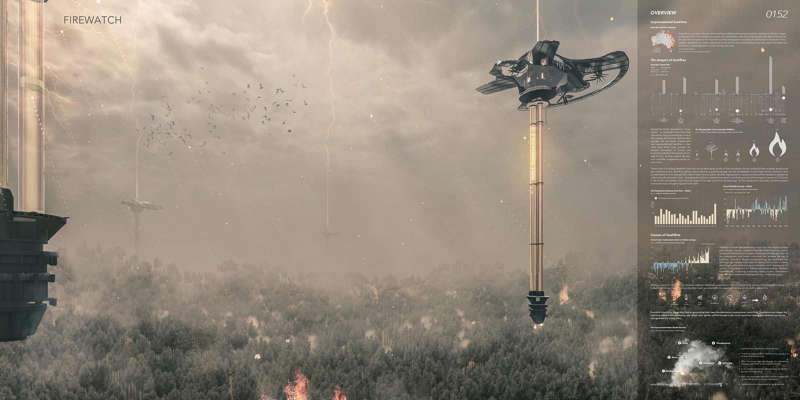
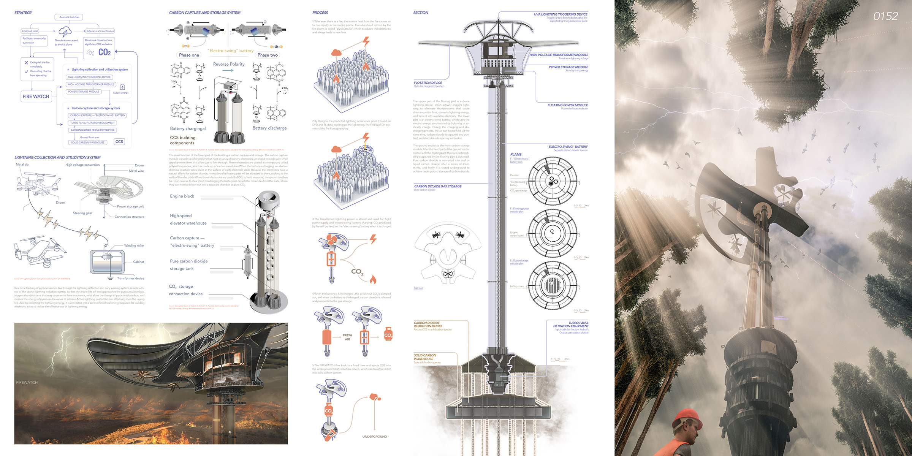

# *Firewatch Skyscraper*

*Authors: **Yuxiang Dong**, Shoubang Huang, Yenan Xiao, Yu Huang*

This project is awarded as [**Editors’ Choice** in 2020 Skyscraper Competition](https://www.evolo.us/firewatch-skyscraper/#more-36746)

Australia’s recent bushfires, described as unprecedented in scale and intensity, have devastated ecosystems, destroyed communities, and released vast quantities of carbon dioxide into the atmosphere, intensifying climate change feedback loops. These fires are driven by extreme weather conditions, including high temperatures, low humidity, and fire-generated thunderstorms that ignite further blazes. In response, this project envisions _FIREWATCH_, an architectural and technological solution designed to mitigate both the spread of wildfires and their environmental impact. FIREWATCH consists of a floating aerial unit and a fixed ground base. The aerial system intercepts pyrocumulus-triggered lightning to prevent secondary ignition, captures carbon dioxide from fire plumes, and stores energy through electro-swing battery technology. Collected CO₂ is transported to the ground base, where it is sequestered into solid carbon forms, reducing long-term atmospheric impact. By combining wildfire suppression, carbon capture, and renewable energy storage, this speculative design proposes a holistic strategy to address the escalating challenges of bushfires in the era of climate change.

# Background
## Unprecedented Bushfires  

Australia is a continent familiar with bushfires, bushfire management and the importance of fires in regenerating the land. The indigenous people have long known the importance of fire management and how it contributes to the health of ecosystems. Bushfires are a well-understood threat, but the fires now burning across the nation have been described as “unprecedented” in their ferocity and scale.

## The Dangers Of Bushfires  

Catastrophic and unprecedented bushfires in Australia have killed many people, destroyed thousands of homes and burned hundreds of thousands of hectares of land, causing massive devastation to wildlife, ecosystems and the environment.

There is also a horrifying feedback loop that occurs when great swaths of land are ablaze, As the number of fires increase, greenhouse gas emissions do too. Bushfires release carbon dioxide, a greenhouse gas, into the atmosphere. In just three months, Australia’s fires are estimated to have released 350 million metric tons of carbon dioxide. Experts warn a century or more will be needed to absorb the carbon dioxide released. In fact，widespread bushfires in Australia have been contributing to one of the largest increases in CO2 levels in the Earth’s atmosphere since records began to be kept more than 60 years ago. As the temperature increases, extreme weather events like major droughts happen more often.

## Causes Of Bushfires

What is causing the fires? This is a complex question. Weather-related factors that contribute to an increased risk of bushfire danger include high temperatures; low humidity; little recent rain; abundant dry vegetation; strong winds; and thunderstorms.

Australia’s bushfires are so big they’re generating their own thunderstorms causing even more fires. Thunderstorms trigger dry lightning without accompanying rain, which then ignites unfired forests is the most important reason why wildfires cannot be extinguished for a long time.
<figure>
  
  <figcaption>Figure 1. Rendering.</figcaption>
</figure>

# The Response: An Envisioned Architectural Solution

In response to a series of problems caused by the mountain fire, we proposed a construction solution. The building consists of a floating part and a fixed ground part, the two parts can be connected by splines. The floating part can fly to the fireplace, absorb the charge from the thunderstorm generated by the fire smoke plume, and prevent the disorderly raging of the new mountain fire by preventing the generation of serial thunderstorm lightning. At the same time, it can capture and collect carbon dioxide, purify the air, and handle the jungle. The large amount of carbon dioxide produced by the fire will further reduce the further impact on the global climate. After the fire, return to the ground base to digest carbon dioxide and complete carbon storage.

- Whenever there is a fire, the intense heat from the fire causes air to rise rapidly in the smoke plume. Cumulus cloud formed by the fire plume is called  ‘pyrocumulus’, which produces thunderstorms and always leads to new fires.

- By flying to the predicted lightning occurrence point ( Based on DPD and TL data) and trigger the lightening, the FIREWATCH prevented the fire from spreading.

- The transformed lightning power is stored and used for flight power supply and ‘ electro-swing ’  battery charging. CO2 produced by fire will be fixed on the ‘ electro-swing ’  battery when it is charged.

- When the battery is fully charged, the air without CO2 is pumped out, and when the battery is discharged, carbon dioxide is released and pumped into the gas storage.

- The FIREWATCH flies back to a fixed base and injects CO2 into the underground CO2 reduction device, which can transform CO2 into solid carbon species.

<figure>
  
  <figcaption>Figure 2. An Envisioned Architectural Solution.</figcaption>
</figure>