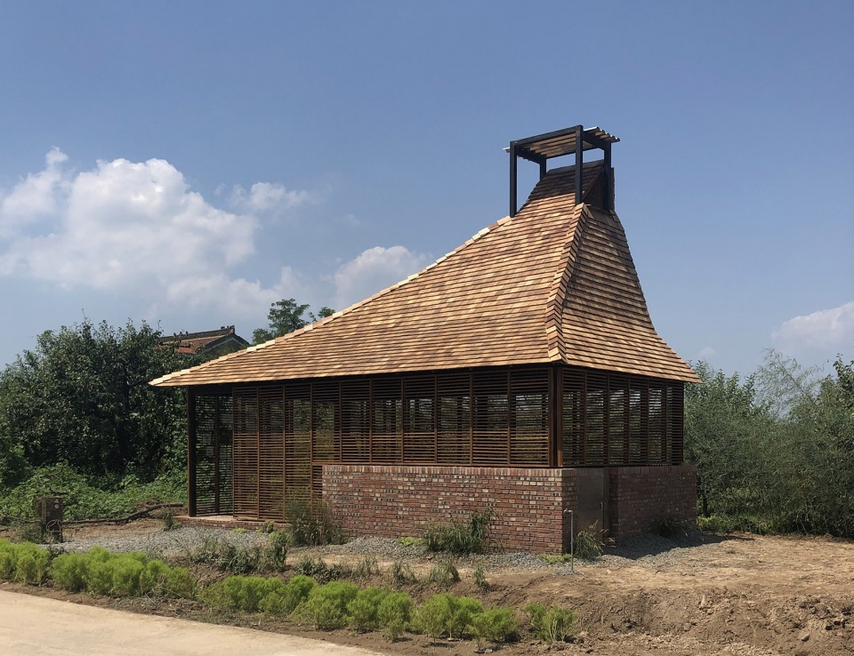
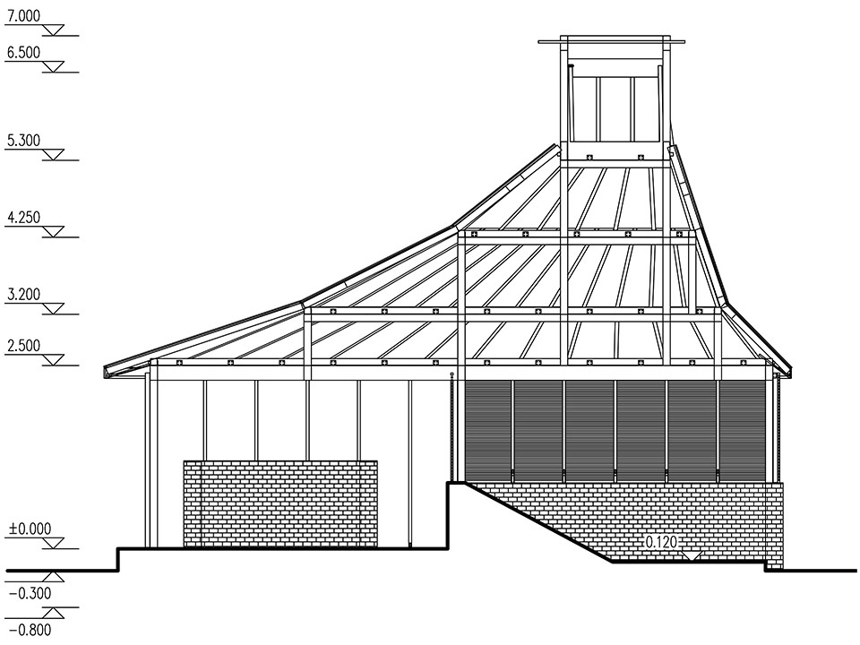
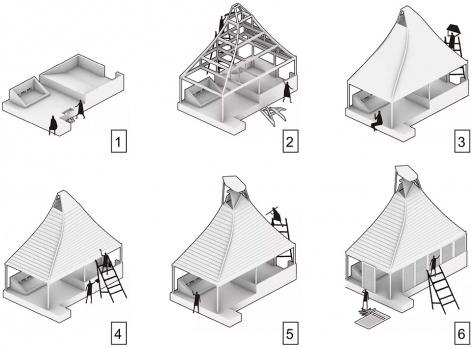
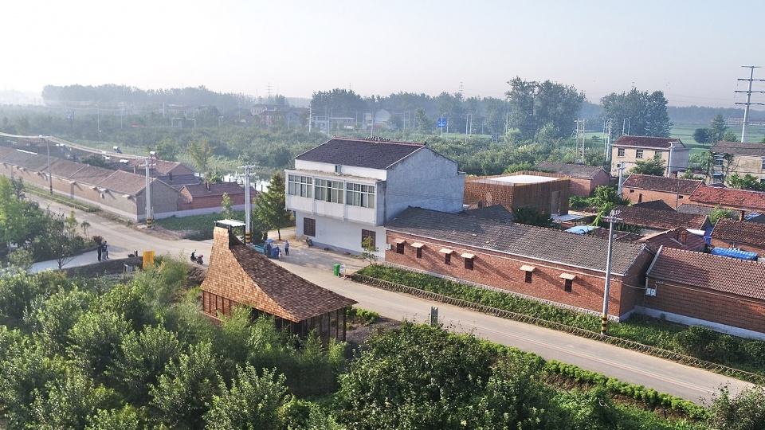

# *Recycling Station in the Pear Orchard*

*Authors: Chongyan Chen, **Yuxiang Dong**, Xinge Zhang, Yuehan Liu, Hanlin Zhang, Chao Zhou, Yilun Yang; Koriki Yuta, Morimoto Tenki, Matsumoto Daiki, Fei Xu, Siyun Rao, Jianghui Ge, Sugiyama Eichi*    
*Advisors: Xiaodong Zheng, Wei Duan, Jia Ma; Suzuki Hiroki,Sun Bingxun*

This project was awarded  **second prize in 2019 UIA-CBC International Colleges and Universities Competitive Construction Workshop**.
Detailed project description can be found on [gooood.cn](https://www.gooood.cn/recycling-station-in-the-pear-orchard-china-beijing-forestry-university-chiba-university.htm?lang=en)

This international construction competition is titled “Pear Garden Cottage”. Relying on the century old pear garden, the whole orchard area is extended as the design and construction base. Siyang, the design site, is located in the center of the intersection of three important cities and adopts modern agricultural technology. With its century old pear garden as the characteristic cultural support, the by-products of pear trees and tourism industry are expected to promote the economic growth of Siyang. However, with the acceleration of urbanization, the new generation of local villagers gradually give up living on pear resources and choose to go out to work. Based on the topic of “design to activate the countryside”, we hope to wake the villagers’ cultural identity, realize the revival of pear culture in the village, facilitate the villagers and solve the local practical problems. From the three design strategies of reconstructing the site characteristics, and to solve the site problems and stimulate the site vitality, the scheme of Liyuan waste recycling station introduced new waste classification and treatment methods, odor removal wind pressure system and other technologies to meet the design requirements.

<figure>
  
  <figcaption>Figure 1. Photo of the building</figcaption>
</figure>

# Design strategy

“Recycling Station in the Pear orchard”, the work of Beijing Forestry University & Chiba University joint team, is based on reconstructing site feature, solving current problem and vigorating the site, which indeed caters the demands of the location. The structure is a modern interpretation of Traditional Chinese Post and Lintel frame. Local materials make up the enclosing membrane, which is regarded as an important method of cultural display as well as construction technique inheritance. Based on the problems existing in the existing site garbage station, such as the non ecological garbage treatment mode and the impact on the surrounding environment, we investigated the garbage treatment mode in China’s rural areas, and found that most of the rural areas do not carry out garbage classification, and most of them use incineration, landfill and other methods to deal with garbage, which is not ecological and needs to be improved. Based on Villagers’ environmental protection concept has low popularity and weak awareness of garbage classification, the villagers simply divide the garbage into perishable garbage and non perishable garbage and put them in separately. The garbage collectors then sort the non perishable garbage. After the introduction of composting bins to compost the perishable garbage, the villagers can get free fertilizer, and the garbage collectors can choose the recyclable garbage. Garbage collection and sale can obtain economic benefits, so as to stimulate both sides to complete garbage collection and classification. According to the chimney effect, a passive wind pressure system is set up to realize the indoor air exchange, so as to achieve the purpose of deodorization.

<figure>
  
  <figcaption>Figure 2. Section of the building</figcaption>
</figure>

In order to adapt to the village environment, we propose to build a traditional Chinese beam lifting building with wood and pear branches as the main materials. The overall form is based on the ancient roof, and combined with the problem that the garbage station will emit peculiar smell, the roof will be transformed into an open vent, which is also an important manifestation of its exhibition. As an important display window, the maintenance structure of pear branch weaving not only makes reasonable use of local materials, but also has an important function of cultural display. Based on the design goal of garbage station: to show the local characteristics, realize the sustainable development of environmental protection, and meet the needs of culture, education and science popularization, we propose three design strategies: reconstruction of site characteristics, solution of site problems, and stimulation of site vitality. We hope that the Liyuan garbage collection station can give consideration to both practicality and beauty, integrate harmoniously into the local houses, and bring new environmental protection concepts to the villagers.

<figure>
  
  <figcaption>Figure 3. Construction of the building</figcaption>
</figure>

Composting box is used to compost the perishable garbage, so as to realize the secondary utilization of garbage, improve the enthusiasm of garbage classification of villagers, and realize the sustainable development of ecology. Garbage dumping is a daily activity of villagers. Liyuan garbage recycling station will be a place where villagers gather, which provides an objective space for villagers to exchange, and also popularizes relevant knowledge of garbage classification and treatment. There is a bulletin board around the garbage station to introduce garbage classification and other knowledge. Villagers who come here to throw garbage and compost can learn more about environmental protection through the bulletin board.

<figure>
  
  <figcaption>Figure 5. Bird view of the building</figcaption>
</figure>